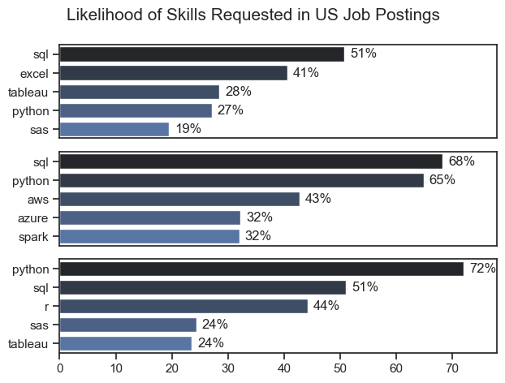
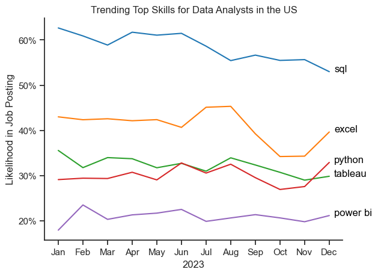
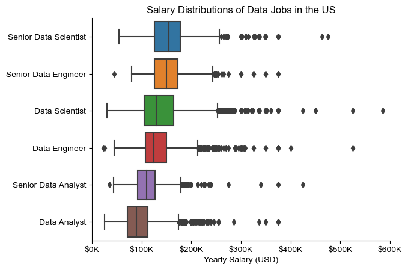
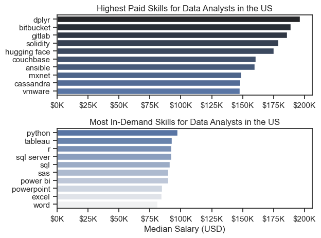
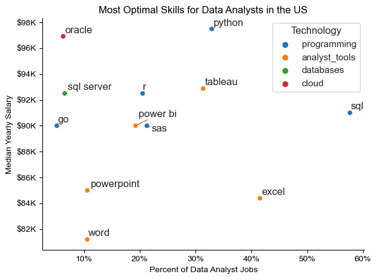

# Overview

Welcome to my analysis of the data job market, focusing on data analyst roles. This project was created out of a desire to navigate and understand the job market more effectively. It delves into the top-paying and in-demand skills to help find optimal job opportunities for data analysts.

The data sourced from [Hugging Face](https://huggingface.co/datasets/lukebarousse/data_jobs) provides a foundation for my analysis, containing detailed information on job titles, salaries, locations, and essential skills. Through a series of Python scripts, I explore key questions such as the most demanded skills, salary trends, and the intersection of demand and salary in data analytics.

# The Questions

Below are the questions I want to answer in my project:

1. What are the skills most in demand for the top 3 most popular data roles?
2. How are in-demand skills trending for Data Analysts?
3. How well do jobs and skills pay for Data Analysts?
4. What are the optimal skills for data analysts to learn? (High Demand AND High Paying) 

# Tools I Used

For my deep dive into the data analyst job market, I harnessed the power of several key tools:

- **Python:** The backbone of my analysis, allowing me to analyze the data and find critical insights.I also used the following Python libraries:
    - **Pandas Library:** This was used to analyze the data. 
    - **Matplotlib Library:** I visualized the data.
    - **Seaborn Library:** Helped me create more advanced visuals. 
- **Jupyter Notebooks:** The tool I used to run my Python scripts which let me easily include my notes and analysis.
- **Visual Studio Code:** My go-to for executing my Python scripts.
- **Git & GitHub:** Essential for version control and sharing my Python code and analysis, ensuring collaboration and project tracking.

# Data Preparation and Cleanup

This section outlines the steps taken to prepare the data for analysis, ensuring accuracy and usability.

## Import & Clean Up Data

I start by importing necessary libraries and loading the dataset, followed by initial data cleaning tasks to ensure data quality.

```python
# Importing Libraries
import ast
import pandas as pd
import seaborn as sns
from datasets import load_dataset
import matplotlib.pyplot as plt  

# Loading Data
dataset = load_dataset('lukebarousse/data_jobs')
df = dataset['train'].to_pandas()

# Data Cleanup
df['job_posted_date'] = pd.to_datetime(df['job_posted_date'])
df['job_skills'] = df['job_skills'].apply(lambda x: ast.literal_eval(x) if pd.notna(x) else x)
```

## Filter US Jobs

To focus my analysis on the U.S. job market, I apply filters to the dataset, narrowing down to roles based in the United States.

```python
df_US = df[df['job_country'] == 'United States']

```

# The Analysis

## 1. What are the most demanded skills for the top 3 most popular data roles?

To find the most demanded skills for the top 3 most popular data roles, I filtered out those positions by which ones were the most popular, and got the top 5 skills for these top 3 roles. This query highlights the most popular job titles and their top skills, showing what skills I should pay attention to depending on the role I am interested to get into.

View my notebook with detailed steps here: [2_skill_Demand.ipynb](3_Project\2_Skills_Demand.ipynb)

### Visualize Data

```python
fig, ax = plt.subplots(len(job_titles), 1)


for i, job_title in enumerate(job_titles):
    df_plot = df_skills_perc[df_skills_perc['job_title_short'] == job_title].head(5)
    sns.barplot(data=df_plot, x = 'skill_percent', y='job_skills', ax=ax[i], palette='dark:b')

plt.show()
```

### Results



### Insights

- Python is a versatile skill highly sought after across all three roles in data (Data Analyst, Data Engineer, Data Scientist), with particularly high demand among Data Scientists (72%) and Data Engineers (65%).
- Data Engineers necessitate specialized technical skills such as AWS, Azure, and Spark, whereas Data Analysts and Data Scientists are expected to excel in more broadly applicable data management and analysis tools like Excel and Tableau.
- SQL emerges as the top skill requirement for Data Analysts and Data Scientists, appearing in over half of the job postings for both roles. Conversely, Python is the predominant skill sought after for Data Engineers, featured in 68% of job postings.

## 2. How are in-demand skills trending for Data Analysts?

### Visualize Data

```python

from matplotlib.ticker import PercentFormatter

df_plot = df_DA_US_percent.iloc[:, :5]
sns.lineplot(data=df_plot, dashes=False, legend='full', palette='tab10')

plt.gca().yaxis.set_major_formatter(PercentFormatter(decimals=0))

plt.show()

```

### Results



*Bar graph visualizing the trending top skills for data analysts in the US in 2023.*

### Insights
- SQL remains the dominant skill, highlighting its foundational role in data analysis despite a gradual decline.
- Excel maintains a significant presence, reflecting its versatility and widespread use, with a notable recovery in demand towards the year-end.
- Python is consistently important, emphasizing its relevance for programming, data manipulation, and analysis.
- Tableau shows a stable demand, indicating the ongoing need for robust data visualization tools.
- Power BI is less prominent but still necessary, suggesting it is a valuable but not primary skill for data analysts.

## 3. How well do jobs and skills pay for Data Analysts?

### Salary Analysis for Data Experts

### Visualize Data

```python

sns.boxplot(data=df_US_top6, x='salary_year_avg', y='job_title_short', order=job_order)

ticks_x = plt.FuncFormatter(lambda y, pos: f'${int(y/1000)}K')
plt.gca().xaxis.set_major_formatter(ticks_x)
plt.show()

```

### Results


*Box plot visualizing the salary distributions for the top 6 data jobs.*

### Insights
#### Holistic Insights:
- General Trend: Senior roles (Senior Data Scientist, Senior Data Engineer, Senior Data Analyst) consistently command higher salaries compared to their junior counterparts (Data Scientist, Data Engineer, Data Analyst).
- Salary Overlaps: There is considerable overlap in salary ranges among different roles, especially between Senior Data Scientists and Senior Data Engineers.
- Outliers: All roles show significant outliers on the higher end, indicating that top performers or those in specific industries/companies can earn considerably more than the typical range.
- Salary Distribution: The salary distribution for each role indicates a positive skew, with most professionals earning within the IQR but a few earning substantially more.
#### Overall Trend:
- High Demand and Value: Senior-level data positions are highly valued and compensated accordingly, reflecting their critical role in driving business decisions and managing complex data systems.
- Competitive Salaries: Even non-senior roles like Data Scientists and Data Engineers offer competitive salaries, showcasing the high demand for these skills in the job market.
- Career Growth: The salary progression from Analyst to Senior positions indicates clear career growth opportunities within the data field.

### Highest Paid and Most Demanded Skills for Data Experts

#### Visualize Data

```python

fig, ax = plt.subplots(2, 1)  

# Top 10 Highest Paid Skills for Data Analysts
sns.barplot(data=df_DA_top_pay, x='median', y=df_DA_top_pay.index, ax=ax[0], palette='dark:b')

# Top 10 Most In-Demand Skills for Data Analysts
sns.barplot(data=df_DA_skills, x='median', y=df_DA_skills.index, ax=ax[1], palette='light:b_r')

plt.show()

```

#### Results


*Two separate bar graphs visualizing the highest paid skills and most demanded skills for data analysts in the USA.*

#### Insights
- The top graph shows specialized technical skills like `dplyr`, `Bitbucket`, and `Gitlab` are associated with higher salaries, some reaching up to $200K, suggesting that advanced technical proficiency can increase earning potential.
- The bottom graph highlights that foundational skills like `Excel`, `PowerPoint`, and `SQL` are the most demanded, even though they may not offer the highest salaries. This demonstrates the importance of these core skills for data roles.
- There is a clear distinction between the skills that are paid high salaries and those that are most in demand. Data Analysts aiming to maximize their career potential should consider developing a diverse skill set including both high-paying specialized skills and most demanded foundational skills.

## 4. What is the most optimal skill to learn for Data Analysts?

#### Visualize Data

```python
from adjustText import adjust_text
from matplotlib.ticker import PercentFormatter

plt.scatter(df_DA_skills_high_demand['skill_percent'], df_DA_skills_high_demand['median_salary'])
ax.xaxis.set_major_formatter(PercentFormatter(decimals=0))

plt.show()

```

#### Results



*A scatter plot visualizing the most optimal skills (high paying & high demand) for data analysts in the USA.*

#### Insights
- The plot shows most of the `programming` skills (blue colored) cluster at higher salary levels compared to other categories, indicating that programming expertise might offer greater salary benfits within the data analytics field.
- Analyst tools (orange colored), including Tablueau and PowerBI offer competetive salaries, showing that visualization and data analysis softwares are crucial for data roles. This category has good salaries as well as versatility in different types of tasks.
- The database skills (green colored), such as Oracle and SQL Server, are associated with high salaries.

# What I Learned

Throughout this project, I deepened my understanding of the data analyst job market and enhanced my technical skills in Python, especially in data manipulation and visualization. Here are a few specific things I learned:

- **Advanced Python Usage**: Utilizing libraries such as Pandas for data manipulation, Seaborn and Matplotlib for data visualization, and other libraries helped me perform complex data analysis tasks more efficiently.
- **Data Cleaning Importance**: I learned that thorough data cleaning and preparation are crucial before any analysis can be conducted, ensuring the accuracy of insights derived from the data.
- **Strategic Skill Analysis**: The project emphasized the importance of aligning one's skills with market demand. Understanding the relationship between skill demand, salary, and job availability allows for more strategic career planning in the tech industry.


# Insights

This project provided several general insights into the data job market for analysts:

- **Skill Demand and Salary Correlation**: There is a clear correlation between the demand for specific skills and the salaries these skills command. Advanced and specialized skills like Python and Oracle often lead to higher salaries.
- **Market Trends**: There are changing trends in skill demand, highlighting the dynamic nature of the data job market. Keeping up with these trends is essential for career growth in data analytics.
- **Economic Value of Skills**: Understanding which skills are both in-demand and well-compensated can guide data analysts in prioritizing learning to maximize their economic returns.


# Challenges I Faced

This project was not without its challenges, but it provided good learning opportunities:

- **Data Inconsistencies**: Handling missing or inconsistent data entries requires careful consideration and thorough data-cleaning techniques to ensure the integrity of the analysis.
- **Complex Data Visualization**: Designing effective visual representations of complex datasets was challenging but critical for conveying insights clearly and compellingly.
- **Balancing Breadth and Depth**: Deciding how deeply to dive into each analysis while maintaining a broad overview of the data landscape required constant balancing to ensure comprehensive coverage without getting lost in details.


# Conclusion

This exploration into the data analyst job market has been incredibly informative, highlighting the critical skills and trends that shape this evolving field. The insights I got enhance my understanding and provide actionable guidance for anyone looking to advance their career in data analytics. As the market continues to change, ongoing analysis will be essential to stay ahead in data analytics. This project is a good foundation for future explorations and underscores the importance of continuous learning and adaptation in the data field.
