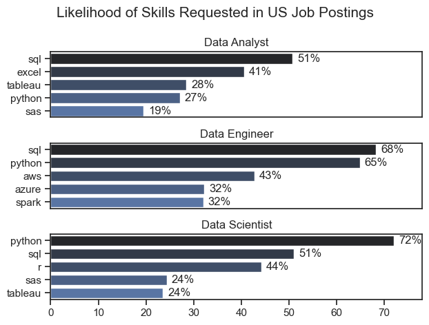

# The Analysis

## 1. What are the most demanded skills for the top 3 most popular data roles?

To find the most demanded skills for the top 3 most popular data roles, I filtered out those positions by which ones were the most popular, and got the top 5 skills for these top 3 roles. This query highlights the most popular job titles and their top skills, showing what skills I should pay attention to depending on the role I am interested to get into.

View my notebook with detailed steps here: [2_skill_Demand.ipynb](3_Project\2_Skills_Demand.ipynb)

### Visualize Data

```python
fig, ax = plt.subplots(len(job_titles), 1)


for i, job_title in enumerate(job_titles):
    df_plot = df_skills_perc[df_skills_perc['job_title_short'] == job_title].head(5)
    sns.barplot(data=df_plot, x = 'skill_percent', y='job_skills', ax=ax[i], palette='dark:b')

plt.show()
```

### Results



### Insights

- Python is a versatile skill highly sought after across all three roles in data (Data Analyst, Data Engineer, Data Scientist), with particularly high demand among Data Scientists (72%) and Data Engineers (65%).
- Data Engineers necessitate specialized technical skills such as AWS, Azure, and Spark, whereas Data Analysts and Data Scientists are expected to excel in more broadly applicable data management and analysis tools like Excel and Tableau.
- SQL emerges as the top skill requirement for Data Analysts and Data Scientists, appearing in over half of the job postings for both roles. Conversely, Python is the predominant skill sought after for Data Engineers, featured in 68% of job postings.

## 2. How are in-demand skills trending for Data Analysts?

### Visualize Data

```python

from matplotlib.ticker import PercentFormatter

df_plot = df_DA_US_percent.iloc[:, :5]
sns.lineplot(data=df_plot, dashes=False, legend='full', palette='tab10')

plt.gca().yaxis.set_major_formatter(PercentFormatter(decimals=0))

plt.show()

```

### Results


*Bar graph visualizing the trending top skills for data analysts in the US in 2023.*

### Insights
- SQL remains the dominant skill, highlighting its foundational role in data analysis despite a gradual decline.
- Excel maintains a significant presence, reflecting its versatility and widespread use, with a notable recovery in demand towards the year-end.
- Python is consistently important, emphasizing its relevance for programming, data manipulation, and analysis.
- Tableau shows a stable demand, indicating the ongoing need for robust data visualization tools.
- Power BI is less prominent but still necessary, suggesting it is a valuable but not primary skill for data analysts.

## 3. How well do jobs and skills pay for Data Analysts?

### Salary Analysis for Data Experts

### Visualize Data

```python

sns.boxplot(data=df_US_top6, x='salary_year_avg', y='job_title_short', order=job_order)

ticks_x = plt.FuncFormatter(lambda y, pos: f'${int(y/1000)}K')
plt.gca().xaxis.set_major_formatter(ticks_x)
plt.show()

```

### Results


*Box plot visualizing the salary distributions for the top 6 data jobs.*

### Insights
#### Holistic Insights:
- General Trend: Senior roles (Senior Data Scientist, Senior Data Engineer, Senior Data Analyst) consistently command higher salaries compared to their junior counterparts (Data Scientist, Data Engineer, Data Analyst).
- Salary Overlaps: There is considerable overlap in salary ranges among different roles, especially between Senior Data Scientists and Senior Data Engineers.
- Outliers: All roles show significant outliers on the higher end, indicating that top performers or those in specific industries/companies can earn considerably more than the typical range.
- Salary Distribution: The salary distribution for each role indicates a positive skew, with most professionals earning within the IQR but a few earning substantially more.
#### Overall Trend:
- High Demand and Value: Senior-level data positions are highly valued and compensated accordingly, reflecting their critical role in driving business decisions and managing complex data systems.
- Competitive Salaries: Even non-senior roles like Data Scientists and Data Engineers offer competitive salaries, showcasing the high demand for these skills in the job market.
- Career Growth: The salary progression from Analyst to Senior positions indicates clear career growth opportunities within the data field.

### Highest Paid and Most Demanded Skills for Data Experts

#### Visualize Data

```python

fig, ax = plt.subplots(2, 1)  

# Top 10 Highest Paid Skills for Data Analysts
sns.barplot(data=df_DA_top_pay, x='median', y=df_DA_top_pay.index, ax=ax[0], palette='dark:b')

# Top 10 Most In-Demand Skills for Data Analysts
sns.barplot(data=df_DA_skills, x='median', y=df_DA_skills.index, ax=ax[1], palette='light:b_r')

plt.show()

```

#### Results


*Two separate bar graphs visualizing the highest paid skills and most demanded skills for data analysts in the USA.*

#### Insights
- The top graph shows specialized technical skills like `dplyr`, `Bitbucket`, and `Gitlab` are associated with higher salaries, some reaching up to $200K, suggesting that advanced technical proficiency can increase earning potential.
- The bottom graph highlights that foundational skills like `Excel`, `PowerPoint`, and `SQL` are the most demanded, even though they may not offer the highest salaries. This demonstrates the importance of these core skills for data roles.
- There is a clear distinction between the skills that are paid high salaries and those that are most in demand. Data Analysts aiming to maximize their career potential should consider developing a diverse skill set including both high-paying specialized skills and most demanded foundational skills.